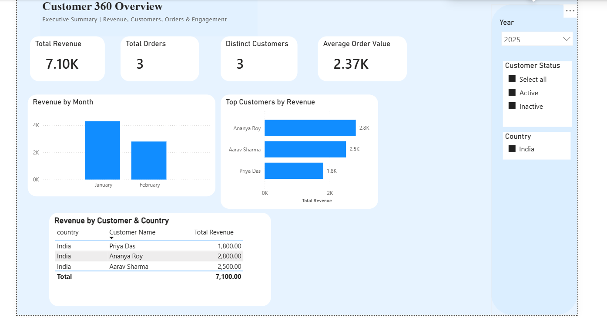
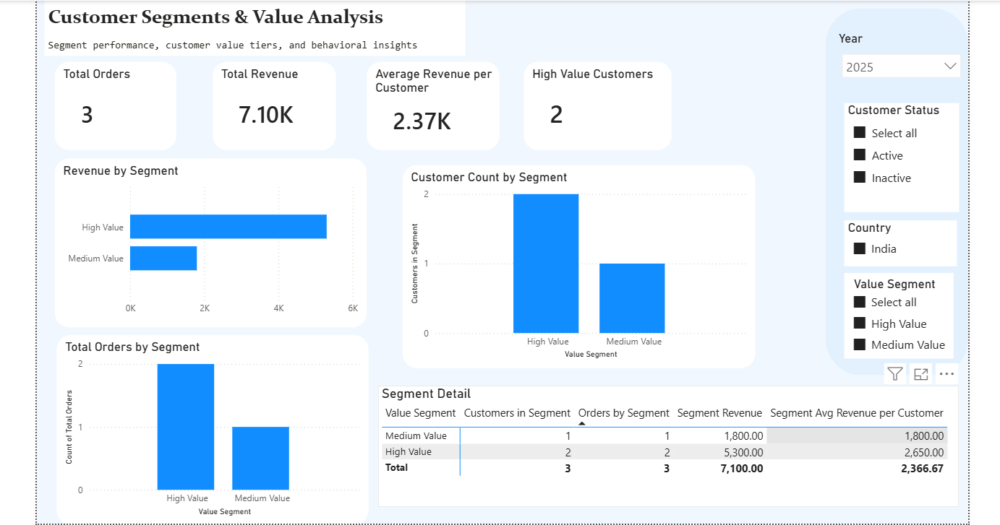

# Customer 360 Power BI Dashboard

A two-page Power BI dashboard focused on customer performance, customer value, and segment-based analysis.

## Business Problem

Businesses need a simple way to monitor overall customer performance and identify which customer segments generate the most value. This report was built to help stakeholders analyze revenue, orders, and customer segments in one clean Power BI solution.

## Project Objective

The goal of this project was to design a two-page Power BI report that:
- Tracks high-level customer KPIs
- Shows executive-level business performance
- Analyzes customer value segments
- Supports interactive filtering by year, customer status, country, and segment

## Tools Used

- Power BI
- DAX
- Data Modeling
- GitHub
- PostgreSQL

## Data Model

This report is built using:
- `mart_fact_orders` for transactional order data
- `mart_dim_customer` for customer attributes
- `Customer Summary` table for segment analysis

The model supports customer-level and segment-level reporting using calculated measures and a summary table created in DAX.

## Key Metrics

The report includes the following business metrics:
- Total Revenue
- Total Orders
- Average Revenue per Customer
- High Value Customers
- Customer Count by Segment
- Segment Revenue
- Segment Average Revenue per Customer

## Report Pages

### 1. Executive Overview

This page provides a high-level summary of customer and revenue performance. It is designed for quick business monitoring using KPIs, trend visuals, and overview-level insights.

### 2. Customer Segments & Value Analysis

This page focuses on segment performance and customer value analysis. It includes KPIs, revenue by segment, customer count by segment, total orders by segment, and a segment detail matrix.

## Data Model View

The report uses a structured model with fact and dimension tables to support interactive filtering and segment-based analysis.

## Key Features

- Two-page Power BI dashboard design
- Interactive slicers for year, customer status, country, and value segment
- Segment-based KPI analysis
- Clean visual layout with consistent report styling
- DAX-based summary table and measures for customer segmentation

## What I Learned

Through this project, I improved my skills in:
- Designing multi-page Power BI reports
- Creating DAX measures for business KPIs
- Building segment analysis using summary tables
- Structuring a report for clearer business storytelling

## Author

Created by [Mrigashree Ray]
